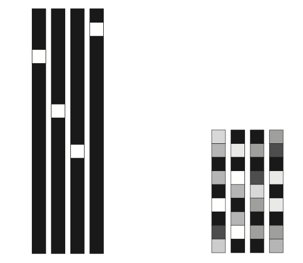
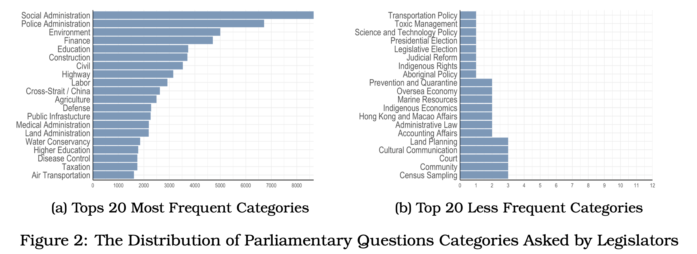
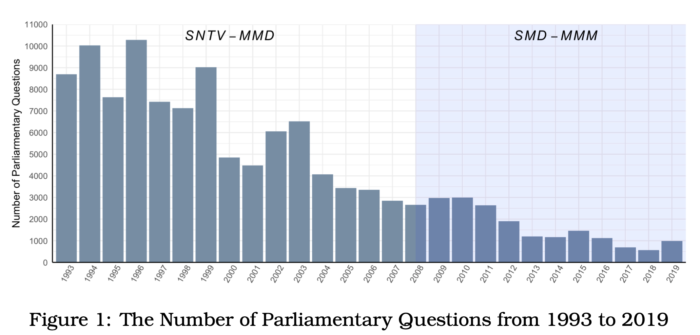

exclude: true

```{r, setup, include = FALSE}
if (!require("pacman")) install.packages("pacman")
library(pacman)
p_load(
  kableExtra, snakecase, janitor, huxtable, pagedown,                                                  # Formatting 
  ggplot2, ggthemes, ggeffects, ggridges, igraph, network, ggpubr, ggformula, gridExtra, RColorBrewer, # Visualization
  tidyverse, lubridate, stringr, dplyr, purrr, tibble, tidyr, lubridate, knitr,                        # General tidyverse toolkit 
  readxl,reshape2, 
  parallel, future, furrr, future.apply, doParallel,                                                   # Paralleling
  devtools, reticulate, usethis                                                                        # programming
)


# Define colors
red_pink   = "#e64173"
turquoise  = "#20B2AA"
orange     = "#FFA500"
red        = "#fb6107"
blue       = "#3b3b9a"
green      = "#8bb174"
grey_light = "grey70"
grey_mid   = "grey50"
grey_dark  = "grey20"
purple     = "#6A5ACD"
brown      = "#9b684d"
black      = "#000000"
magenta_red    = "#9b4d80"
magenta_green  = "#4d9b68"
red_green      = "#9b4d59"
blue_green     = "#4d599b"
magenta_yellow = "#9b8f4d"


# Knitr options
opts_chunk$set(
  comment = "#>",
  fig.align = "center",
  fig.height = 7,
  fig.width = 10.5,
  warning = F,
  message = F
)
opts_chunk$set(dev = "svg")
options(
  device = function(file, width, height){
    svg(tempfile(), width = width, height = height)
    })
options(knitr.table.format = "html")
```


```{python include=FALSE}
# Built-in Library
import math
import re
import collections
import zipfile
import random
from itertools import chain
import pandas as pd
import numpy as np

# ML & Deep Learning
from sklearn.model_selection import train_test_split
import tensorflow as tf
from tensorflow.keras import layers
import tensorflow_datasets as tfds
from tensorflow.keras.callbacks import EarlyStopping,TensorBoard
from transformers import BertTokenizer

# NLP toolkit
import spacy

# Visualization
import seaborn as sns
import matplotlib.pyplot as plt

# Dimensional Deduction
from sklearn.decomposition import PCA
```


---
layout: true
# .tiny[Overview]
---
name:overview

- .small.hi-grey[Motivation:]  <br> 
  .small[- How does the electoral reform change legislators’ preference and their intentions to bring home the bacon?]  

--
- .small.hi-grey[Theoretical Expectation:] <br> 
  .small[- Scholars have clearly explained why intraparty competition by different rules of electoral systems increases legislators’ incentives to run on a personal reputation] 
  .small[- We however know little about whether actual impacts introduced by the electoral reform through MMD (Multi-members District) to SMD (Single-member District) reduce legislators’ motives to pursue pork barrel project in the legislature.]

--
- .small.hi-grey[Data and Method:] <br> 
  .small[- I train deep learning models using Convolutional Neural Networks on top of embedding layer extracted from *Transformer BERT* to evaluate pork-barrel activities in parliamentary questions.]
  .small[- Approximately 150,000 PQs since 1993]  

--
- .small.hi-grey[Major Finding:] <br> 
  .small[- Evidence exists to show that legislators under MMD are more likely to express political intention about pork-barrel projects in written parliamentary questions.]
  .small[- The reform have heterogeneous impacts on mainstream parties vis-à-vis small parties.]

---
layout: true
# .tiny[Why Parliarmentary Questions]
---
name:why-pq

#### Legislaive activities such as .ul.hi-grey[_legislative votings_], .ul.hi-grey[_debates_] (*e.g, ParSpeech V2*) and .ul.hi-grey[_parliamentary questions_] (*e.g, LACAN*) play a significant role in most democracies. 

--

> __Roll Calls__: Legislative votings are generally dominent by party 

> + .grey-light.it[Slapin et. al (2018): Politicians grandstand strategically against party in the British Parliament]

> + .grey-light.it[Park (2021): in US House committee Hearings]

--

> __Debates__: MPs are not equally access to floor speech

--

#### The advantages of using the PQs: 

> .ul.hi-grey[_comprehensive_], .ul.hi-grey[_accessible_], and .ul.hi-grey[_rich_] 

--

> The party leadership have less control over MP's motivation to employ parliamentary questions .grey-light.it[(Shane 2011)].

--

> Parliamentary questions may reveal MPs' interests in policy preference .grey-light[(Shane 2011; Saalfeld 2011)].
 
---

&nbsp;

#### MPs ask questions for several reasons:

> + Because of their .hi-grey[expertise] or domain responsibility of delegation for question topics.

--

> + Personal preference such as their nature of .hi-grey[substantive representation] .grey-light.it[(Russo 2021; Saalfeld 2011; Martin 2011)]


  
--
  
> + Electoral motivation: .hi-grey[personal reputation] .grey-light[(Martin 2011)]

---
layout: true
# .tiny[Implication]
---
name:implication

&nbsp;
&nbsp;

#### In this paper:

> + I introduce the case of .hi-grey[__Taiwan Legislative Yuan__], where the electoral system reformed through SNTV to SMD, to evaluate how electoral motives shape legislators' tendency to pork-barrel projects under different electoral systems.

--

> + Parliamentary questions are the primary channel for legislators to .hi-grey[scrutinize the government] and .hi-grey[express political intentions]. 

--

> + These parliamentary questions allow identification of different .hi-grey[_question topics_], .hi-grey[_categories_] and further information regarding .hi-grey[_legislators' opinions of policy interests and agenda at the individual level_].

---
layout: true
# .tiny[Background & Literature]
---
name:background

&nbsp;&nbsp;

#### Theoretical Expectation:

> + The SNTV-MMD was the major system to elect legislators before 2008 in Taiwan. 

--

> + This was thought to intensify majority-seeking parties to run more than one candidate in a district, which increases incentives for candidates to run on personal votes against their party reputation .grey-light[(Cox 1990; Carey and Shugart 1995)]. 

--

> + Under SNTV, co-partisan candidates cannot rely exclusively on their party reputation and have to find an alternative means of attracting votes by .hi-grey[running on a personal reputation] via .hi-grey[providing paricularistic services] .grey-light[(Cain, Ferejohn, and Fiorina 1987; Reed 1994; Carey and Shugart 1995)].


---

&nbsp;&nbsp;

#### SNTV in Taiwan Before 2008


> + The SNTV in Taiwan was criticized for creating .hi-grey[excessive intra-party chaos and competition] .grey-light[(Cox 1990; Hirano 2006; Ames 2001)], as well as .hi-grey[encouraging factional and candidate-centered electoral politics] .grey-light[(e.g. Batto and Huang 2016; Wu 2003)]. 

--

> + Luor and Liao (2009) finds that the more pork-barrel legislation legislators propose, the higher grant allocation the municipalities (districts) receive.

--

> + Catalinac (2016) finds that LDP (Liberal Democratic Party) candidates under the SMDs in Japan adopted new electoral strategies by mentioning programmatic policies such as national security.

---

&nbsp;&nbsp;&nbsp;

#### Hypothesis:

> _Hypothese Ⅰ: Under the SNTV-MMD, legislators are more likely to propose the questions regarding the provision of particularistic goods._

> _Hypothese ⅠⅠ: Under the SMD-MMM, legislators are more like to ask the questions related to programmatic and regulatory policies_

---
layout: true
# .tiny[Research Design]
---
name:research-design

&nbsp;&nbsp;

#### Training Deep Learning Model:

> Existing labelled pork legislation from 2007 to 2008


> Train a machine to identify pork-barrel features on parliamentary questions over time. 

--

#### Regression Analysis:

> Regression analyses are employed to answer the research questions.

> Control for the effects from legislators and municipalities across the years. 


---

#### Training Data (Pork-barrel Legislation):


> - The gold standard for identifying the pork-barrel legislation is based on the target beneficiaries of the policy (distributed vs concentrated)  and attributes of policy cost (distributed vs concentrated).

--

> - Typical pork-barrel policies (or legislation) mainly incur distributed costs while generating parochial benefits for .ul.hi-grey[_specific regions_] or .ul.hi-grey[_designated population groups_].

--

> - This dataset was cross-coded by three social science researchers to perform its validity, which achieves 98% in terms of consistency and preciseness among coders .grey-light[(Luor and Hsieh 2008; Luor and Liao 2009)].

```{r echo = F, out.width = "38%"}
knitr::include_graphics("./images/porktype.png")
```


---
layout: true
# .tiny[BERT Layers + Convolutional Neural Nets ]
---

#### Strength:

> self-attention mechanism  

> dealing with .ul.hi-grey[_unseen words_], particularily in Chinese (unspaced language).

> Hate speech detection .grey-light[(Safaya, Abdullatif, and Yuret 2020)] and patent document classification .grey-light[ (Lu and Ni 2019)]

```{r echo = F, out.width = "60%"}
knitr::include_graphics("./images/framework.png")
```

---
layout: true
# .tiny[Pork Featured Questions]
---
name:sampled-pork
 
&nbsp;
&nbsp;
&nbsp;
&nbsp;

| Legislator |       Questions         |                  Topics                      |                        Keywords                      |
|:----------:|:------------------------|----------------------------------------------|------------------------------------------------------|
| 陳啟昱	   |鑑於現行《所得稅法》第十 | Income tax; education expenses; deductions   | Special Deductions; Educational .ul.hi-grey[_Expenditure_]     |
| 彭添富	   |針對「辦理九十四年原住民 | Aboriginal life                              |	housing .ul.hi-grey[_subsidies_]                     |
| 李復興	   |發現自九十三年一月間起   | labor retirement benefits                    |	Retired employees .ul.hi-grey[_allowance_] for the elderly      |
| 盧秀燕	   |針對早期退除役軍官給與補 | Veterans welfare                             |	.ul.hi-grey[_Grants_] for early retired officers     |
| 丁守中	   |針就民眾陳情指出，目前政 | Welfare for the handicapped                  |	Living .ul.hi-grey[_allowance_]                      |
| 馮定國	   |鑒於國內經濟結構的快速   | Elderly .ul.hi-grey[_welfare_]               |	Aging; middle and old age unemployment               |
| 彭添富	   |針對「豪雨成災，         | Agricultural .ul.hi-grey[_subsidies_]        |	Heavy rain; crops                                    |
| 曾華德	   |為民國38年至43年間戌     | Military .ul.hi-grey[_pay_]                  |	Anti-Communist Salvation Army Reimbursement of Salary|


---
layout: true
# .tiny[Less-pork Featured Questions]
---
name:sampled-non-pork

&nbsp;
&nbsp;
&nbsp;
&nbsp;

| Legislator |       Questions         |                  Topics                      |                        Keywords                      |
|:----------:|:------------------------|----------------------------------------------|------------------------------------------------------|
| 李復甸	   |鑑於刑事偵察實務上緩起   |Investigation; litigation procedure           |	.ul.hi-grey[_Criminal investigation_] ; secret witness|
| 林建榮	   |為立法院朝野協商修改銀   |Financial management; bank management         |	.ul.hi-grey[_Banking Law_]; Cash Card; Revolving Interest Rate      |
| 林正峰	   |針對行政院長張俊雄日前   |Energy policy                                 |	Energy saving                                        |
| 林正峰	   |鑑於近年來臺灣地區毒品   |Tobacco Restriction; Hospital                 |	.ul.hi-grey[_Drug Abuse_]; Departmental Hospital                    |
| 王幸男	   |針對道路人孔蓋或管線挖   |Public Safety                                 |	Manhole cover; .ul.hi-grey[_public safety_]; road quality           |
| 管碧玲	   |針對近日台灣鐵路管理局	 |Railway management; ticket	                  | .ul.hi-grey[_Online booking_]; monopoly; Taiwan Railway             |
| 黃敏惠	   |就近日來爆發知名提神飲   |Drinks; Poisoning                             |	Drinks; Poisoning, .ul.hi-grey[_Poisoning_]                  |
| 陳朝龍	   |針對英國政府宣稱台灣出   |Infectious disease prevention and control     |	British Government; Taiwanese birds; Avian Influenza  .ul.hi-grey[_Avian Influenza_]  |


---
layout: true
# .tiny[Tentative Findings]
---
name:parliarmentary-questions  


&nbsp;


```{r echo = F, out.width = "80%"}
knitr::include_graphics("./images/num.png")
```


---

&nbsp;


```{r echo = F, out.width = "80%"}
knitr::include_graphics("./images/reg.png")
```


---

&nbsp;


```{r echo = F, out.width = "80%"}
knitr::include_graphics("./images/mean.png")
```


---
layout: true
# .tiny[Takeaway]
---

&nbsp;&nbsp;

#### Takeaway


- Evidence exists to show that legislators under SNTV are more likely to ask pork-barrel projects in the questions. 

--

- The reform  demonstrates heterogeneous effects on manistream parties vis-à-vis small parties  

--

#### The Limitation:

> __Training Data__: The pork barrel legislation from training data used in this paper has been nearly ten years. The deep learning classifier might fail to capture unknown concepts developed after the post-reform period. 

--

> __Social Media?__: A steady decrease in the total number of PQs since 2003

---
layout: false
class: inverse, center, middle

# Thank You

---
layout: true
# .tiny[Table of the Appendix]
---
name:appendix

&nbsp;
&nbsp;
&nbsp;

#### Supplementary

.turquoise.smaller[
[An Example of Parliamentary](#parliamentary-questions) | [The Number of Parliamentary Question](#num-pq) | [The Performance of the Models](#performance) | [Number of Train/ Test Sets](num-train-test)
]


#### Embedding Types

.turquoise.smaller[
 [One-hot Encoding](#one-hot-encoding) |  [Static Embedding Vectors](#static-embedding-vectors) | [Contexted-based BERT Embedding](#bert) | [One-hot vs Embedding Representation](#one-hot-embedding)
 ]

#### Miscellaneous

.turquoise.smaller[
[TensorBoard of PorkCNNBERT](https://tensorboard.dev/experiment/2Jm6GKexQiKaLyUz5uKSzg/#scalars) | [legisCrawler: An Toolkit for Retrieving Taiwan Parliamentary Questions](https://github.com/davidycliao/legisCrawler)

]

---
layout: true
# .tiny[Parliarmentary Questions]
---
name:parliamentary-questions  

- In order to analyze parliamentary questions, I have webscraped the parliamentary questions from the official website of Taiwan Legislative Yuan from 1993 to 2020, including the relevant information about .ul.hi-grey[_the classified topics_], .ul.hi-grey[_selected keywords_] and the corresponding .ul.hi-grey[_question type_].
 
```{r echo = F, out.width = "65%"}
knitr::include_graphics("./images/image3.png")
```


---
layout: true
# .tiny[One-hot Encoding]
---
name:one-hot-encoding

&nbsp;
&nbsp;


```{r echo = F, out.width = "60%"}
knitr::include_graphics("./images/onehot.png")
```


---
layout: true
# .tiny[Number of Train/ Test Sets]
---
name:num-train-test


- The collection of this data set consists of .ul.hi-grey[_7243 pieces of legislation_] which were annotated as .ul.hi-grey[_Pork_] or .ul.hi-grey[_Non-Pork_].

```{r echo = F, out.width = "55%"}
knitr::include_graphics("./images/full_plot.png")
```

---
layout: true
# .tiny[Static Embedding Vectors]
---
name:static-embedding-vectors 

&nbsp;
&nbsp;

```{r echo = F, out.width = "70%"}
knitr::include_graphics("./images/static.png")
```

---
&nbsp;
&nbsp;

```{python eval=FALSE}
nlp = spacy.load("en_core_web_sm")
vocab = nlp("R and Python are my favorite programming languages")
words = [word.text for word in vocab]
vecs = np.vstack([word.vector for word in vocab if word.has_vector])
pca = PCA(n_components=2)
vecs_transformed = pca.fit_transform(vecs)
```

```{python eval=FALSE}
plt.figure(figsize=(10, 7))
plt.scatter(vecs_transformed[:,0], vecs_transformed[:,1]) 
for word, coord in zip(words, vecs_transformed):
  x, y = coord
  plt.text(x, y, word, size=7)
plt.xlabel("Word Embedding via en_core_web_sm model from SpaCy")  
plt.show()
```

---
layout: true
# .tiny[Contexted-based BERT Embedding]
---
name:bert

&nbsp;
&nbsp;


```{r echo = F, out.width = "80%"}
knitr::include_graphics("./images/vis1.png")
```

---

&nbsp;
&nbsp;

```{python eval=FALSE}
from transformers import AutoTokenizer
from bertviz.transformers_neuron_view import BertModel 
from bertviz.neuron_view import show
tokenizer = AutoTokenizer.from_pretrained("bert-base-uncased")
model = BertModel.from_pretrained("bert-base-uncased")
text = "R and Python are my favorite programming languages [SEP] Python is a snake"
show(model, "bert", tokenizer, text, display_mode="light", layer=0, head=8)
```


---
layout: true
# .tiny[One-hot vs Embedding Representation]
---
name:one-hot-embedding
&nbsp;
&nbsp;
&nbsp;

```{r echo = F, out.width = "40%"}

```

.pad-left[.grey-light.it[Source:Deep Learning with Python 2019, p151]]


---
layout: true
# .tiny[The Performance of CNN, BERT and CNN-BERT]
---
name:performance
&nbsp;
&nbsp;

&nbsp;

```{r echo = F, out.width = "80%"}
knitr::include_graphics("./images/performance.png")
```


---
layout: true
# .tiny[The Distribution of Parliamentary Questions Categories]
---
name:dis-keyowords
&nbsp;
&nbsp;

```{r echo = F, out.width = "80%"}

```


---
layout: true
# .tiny[The Number of Parliamentary Questions from 1993 to 2019]
---
name:num-pq
&nbsp;
&nbsp;

```{r echo = F, out.width = "80%"}

```


```{r eval=FALSE, include=FALSE}
pagedown::chrome_print("file:///Users/yenchiehliao/Dropbox/erpb/slides/slides.html#1", verbose = FALSE)
```


