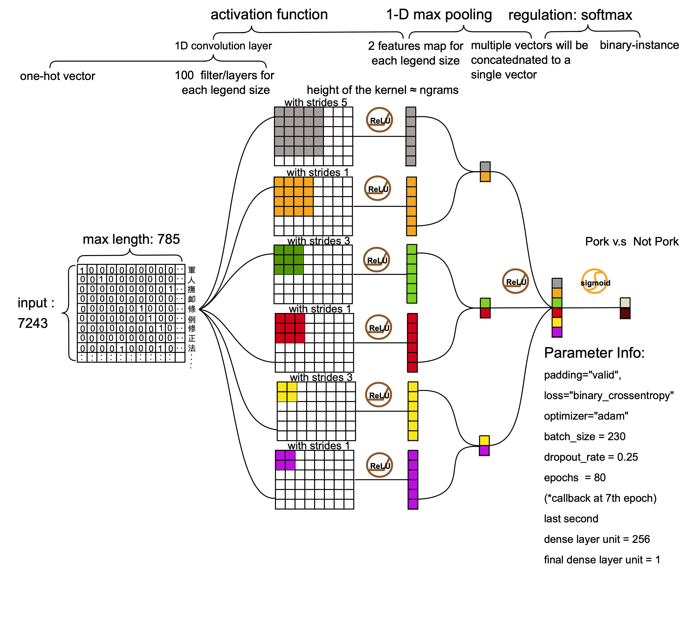
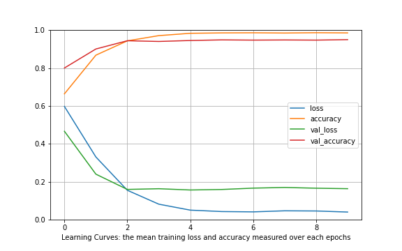
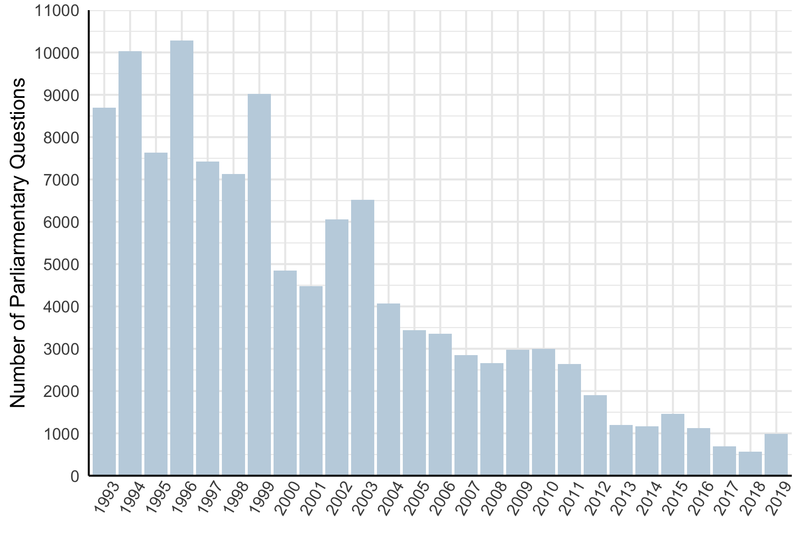
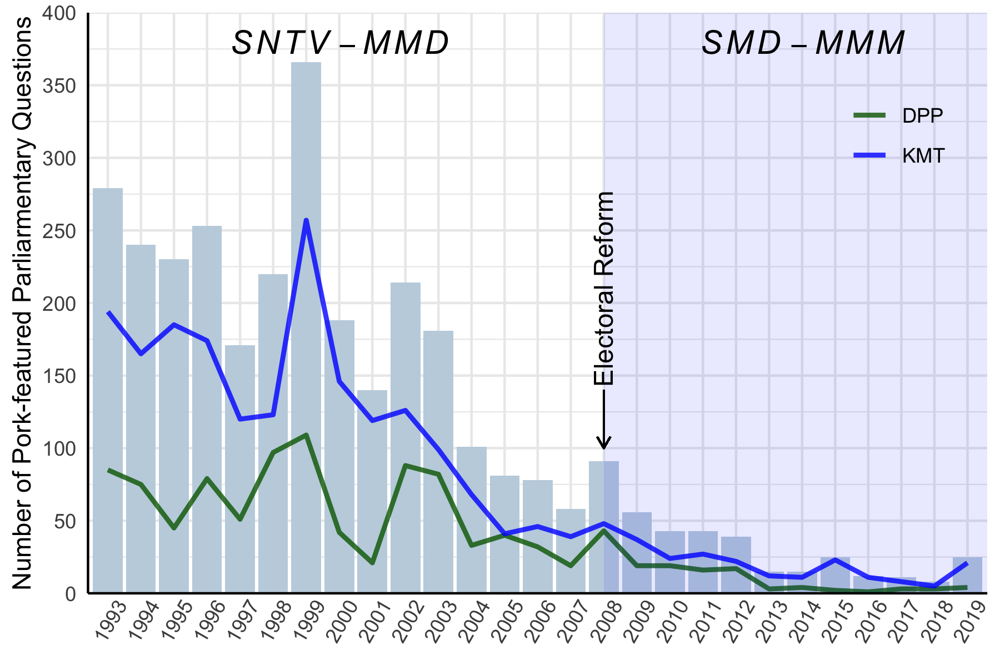

exclude: true


```{r, include = F}
# template refers to:@edrubin
if (!require("pacman")) install.packages("pacman")
library(pacman)
p_load(
  kableExtra, snakecase, janitor, huxtable, pagedown,                                                  # Formatting 
  ggplot2, ggthemes, ggeffects, ggridges, igraph, network, ggpubr, ggformula, gridExtra, RColorBrewer, # Visualization
  tidyverse, lubridate, stringr, dplyr, purrr, tibble, tidyr, lubridate, knitr,                        # General tidyverse toolkit 
  readxl,reshape2, 
  parallel, future, furrr, future.apply, doParallel,                                                   # Paralleling
  emIRT, MCMCpack, wnominate, pscl, rgenoud, basicspace,                                               # Measurement Scaling   
  devtools, reticulate, usethis                                                                        # programming
)


p_load_gh("kosukeimai/emIRT", # for scaling from Github
          "tzuliu/ooc",
          "cran/oc",
          "uniofessex/asmcjr",
          "wmay/dwnominate", dependencies = TRUE)


# Define colors
red_pink   = "#e64173"
turquoise  = "#20B2AA"
orange     = "#FFA500"
red        = "#fb6107"
blue       = "#3b3b9a"
green      = "#8bb174"
grey_light = "grey70"
grey_mid   = "grey50"
grey_dark  = "grey20"
purple     = "#6A5ACD"
brown      = "#9b684d"
black      = "#000000"
magenta_red = "#9b4d80"
magenta_green = "#4d9b68"
red_green = "#9b4d59"
blue_green = "#4d599b"
magenta_yellow = "#9b8f4d"


# Knitr options
opts_chunk$set(
  comment = "#>",
  fig.align = "center",
  fig.height = 7,
  fig.width = 10.5,
  warning = F,
  message = F
)
opts_chunk$set(dev = "svg")
options(device = function(file, width, height) {
  svg(tempfile(), width = width, height = height)
})
options(knitr.table.format = "html")

# pagedown::chrome_print("file:///Users/yenchiehliao/Dropbox/elp/slides/slides.html#1", verbose = FALSE)


```

---
layout: true
# Research Questions
---
name:questions

&nbsp;

- In this paper, we quantitatively investigate legislators’ electoral strategies and communication style by applying a deep learning model to measure pork-barrel features on .hi-grey[parliamentary questions] in Taiwan Legislative Yuan. 

--

- Research Questions:

 1. Are the legislators in the SNTV-MMD (single non-transferable vote in multi-member districts) more likely to bring home the bacon by promising the provision of particularistic goods?
 
--

 2. Does the switch of electoral system from the SNTV to the SMDs (single member districts) reduce legislators' incentives to cultivate a personal reputation by paying less attention to distributive (pork barrel) policies?
 
--

 3. Dose it change legislator electoral strategies by increasing more attention to universalism policies such as regulatory policies?

---
layout: true
# Background
---
name:questions

&nbsp;

- The SNTV-MMD was the major system to elect legislators before 2008 in Taiwan. 

--

- This was thought to intensify majority-seeking parties to run more than one candidate in a district, which increases incentives for candidates to run on personal votes against their party reputation. Given this, candidates were competing with competitors from not only opponent parties, but the same party as well.

--

- The SNTV-MMD in Taiwan has been criticized for creating .hi-grey[excessive intra-party chaos and competition] (Cox 1990; Hirano 2006; Ames 2001), as well as .hi-grey[encouraging factional and candidate-centered electoral politics] (e.g. Batto and Huang 2016; Wu 2003). 

--

- Therefore, some East-Asian democracies in 1990s  such as  Japan, South Korea and Taiwan started to reform the electoral system by changing SNTV-MMD to single-member districts (SMD-MMM). 

---
layout: true
# The Literature: Personal Votes
---
name:literature

&nbsp;

- The electoral system such as SNTV-MMD, which combines plurality rule with a single vote per voter and a district magnitude larger than one, was believed to .hi-grey[increase intra-party (centrifugal) competition] (Cox 1990; Carey and Shugart 1995).

--

- Under the SNTV-MMD, parties or party leaders have incentive to nominate more than one candidate to run in each district, which required their .hi-grey[candidates to compete against each other]. 

--

- Therefore, co-partisan candidates cannot rely exclusively on their party reputation and have to find an alternative means of attracting votes by .hi-grey[running on a personal reputation] via providing paricularistic services as called “personal vote” (Cain, Ferejohn, and Fiorina 1987; Reed 1994; Carey and Shugart 1995).

---
layout: true
# The Literature: Pork Barrel Politics
---
name:literature

&nbsp;

- An examination of the relationship between electoral systems and the “pork-barrel” phenomenon is being investigated in light of the explosion of interest in the past decade in .hi-grey[the effects of different electoral systems] on policy outputs (e.g., Hirano 2005; Samuels 2002; Stratmann and Baur 2002; Lancaster and Patterson 1990; Lancaster 1986). 

--

- The literature focusing on Taiwan distributive politics has investigated the effects of the electoral reform that .hi-grey[decreases legislators' incentive to bring home the bacon].

--

- For example, Sheng (2014a) and Sheng (2014b) investigate the impacts of electoral reform on changes of bill sponsorship with regards to particularistic goods among legislators. Luor and Hsieh (2008) and Luor and Liao (2009) focus on the impact of district magnitude on legislators’ incentive to propose pork barrel-related bills. 

---

&nbsp;

- In similar, Catalinac (2016) finds that LDP (Liberal Democratic Party) candidates under the SMDs in Japan adopted new electoral strategies by providing programmatic policy benefits such as national security among other candidates affiliated with LDP party, .hi-grey[reducing promise of pork barrel goods] and intra-party competition.

--

- Given this the SNTV system, candidates were competing with competitors from not only opponent parties, but the same party as well. As results, candidates were incentivized to attract votes by .hi-grey[giving out more distributive benefits] to their own constituency, rather than nation-wide.

--

- Under the SNTV-MMD, candidates face the major .hi-grey[threat from co-partisan candidates] and therefore, are likely to seek personal votes by promising particularistic benefits for their sincere voters (Cain et al. 1987; Carey and Shugart 1995; Catalinac 2016).


---
layout: true
# Research Design
---
name:research-design

### Training Deep Learning Model

- We have trained a convolutional neural network with TensorFlow 2.6 on the human-labelled pork-barrel legislation, including the bills and the amendments from Legislative Yuan.

```{r echo = F, out.width = "50%"}
knitr::include_graphics("./images/diagram.png")
```

- The collection of legislation was manually labelled with binary-instance classification by Dr. Ching-Jyuhn Luor and his research team at National Taipei University.

---

### Labeld Pork-barrel Legislation for Training the Model

- They have created .hi-grey[hand-labelled legislation] by reading the purpose of statute, devoted either to promoting the pork-barrel project (earmarked projects) in .hi-grey[a district] or cultivating favored .hi-grey[specific population groups] by providing subsidies such as agriculture allowance to the farmers ( Luor and Hsieh 2008; Luor and Liao 2009; Luor and Chan 2012).

 
```{r echo = F, out.width = "40%"}
knitr::include_graphics("./images/billeg.png")
```

---

### Number of Train/ Test Splits

- The collection of training data consists of 7243 pieces of legislation in total and containing 4852  (Not Pork vs Pork: 3167, 1685) training sets and 2391 (Not Pork vs Pork: 1566, 825) test sets, respectively. 

```{r echo = F, out.width = "65%"}
knitr::include_graphics("./images/full_plot.png")
```


---
layout: true
# Declaring the CNN Model
---
name:cnn-model

###  Model and Building
- The implementation of the CNN is similar to that described by .grey[[Kim (2014)](https://aclanthology.org/D14-1181/)], except that this paper does not apply word embedding model for tokenization. 

```{r echo = F, out.width = "45%"}

```

- The actual graph in [Tensorboard](https://tensorboard.dev/experiment/2Jm6GKexQiKaLyUz5uKSzg/#graphs&run=20210709-125209%2Ftrain). 
---
layout: true
# Performance 
---
name:performance

&nbsp;
 
- The mean training loss and accuracy measured over each epochs, and the validation loss and accuracy measured at the end of each.

- Show all learning curve history until 1000 epochs (see, [Tensorboard](https://tensorboard.dev/experiment/2Jm6GKexQiKaLyUz5uKSzg/#scalars))

```{r echo = F, out.width = "65%"}

```

---
layout: true
# Parliarmentary Questions  
---
name:parliamentary-questions  

&nbsp;

- For exploration of parliarmentary questions, I have web scraped the parliamentary questions and the speeches from The Website of Taiwan Legislative Yuan from 1993 to 2020, including categories of information with regards to the topic, keywords and the type.
 
```{r echo = F, out.width = "50%"}
knitr::include_graphics("./images/image3.png")
```

---

&nbsp;

- The figure shows the total number of parliamentary questions each year from Tawan Legislative Yuan. 

```{r echo = F, out.width = "70%"}

```

```{r eval=FALSE, include=FALSE, paged.print=FALSE}
p1 <- df_paper3 %>%
  filter(year>=1993 ) %>%
  group_by(year) %>%
  summarise(n = n(),
            .groups = 'drop') %>%
  ggplot(aes(x = as.factor(year), y = n, group =1)) +
  geom_bar(stat="identity", fill="#C2D3E0") +
  xlab(NULL) +
  ylab("Number of Parliarmentary Questions" )+
  theme_minimal() +
  theme(axis.text.x = element_text(angle = 60, hjust = 0.5, vjust = 0.7)) +
  theme(axis.line = element_line())+
  scale_y_continuous(expand = c(0, 0), breaks=c(seq(0,12000,1000)),limits = c(0, 11000)) 

ggsave("p1.png", width = 6, height = 4)

```


---
layout: true
# Tentative Findings
---
name:parliarmentary-questions  


&nbsp;

- The figure shows the number of parliamentary questions identified as pork barrel feature by the CNN model across year. 

```{r echo = F, out.width = "70%"}

```

```{r eval=FALSE, include=FALSE, paged.print=FALSE}
p2 <- df_paper3 %>%
  filter(year>=1993 & party %in% c("DPP", "KMT")) %>%
  group_by(year, party) %>%
  summarise(pork_dummy = sum(pork_dummy),
            mean = mean(pork_value),
            .groups = 'drop') %>%
  ggplot(aes(x = as.factor(year), y = pork_dummy, group = party)) + 
  geom_bar(stat="identity", fill="#C2D3E0") +
  geom_line(aes(color = party),alpha= 0.8, size = 1) +
  xlab(NULL) +
  ylab("Number of Pork-featured Parliarmentary Questions" )+
  scale_y_continuous(expand = c(0, 0), breaks=c(seq(0,400,50)),limits = c(0,400)) +
  scale_color_manual(values = c("#006600", "#0000ff")) +
  theme_minimal() +
  theme(axis.text.x = element_text(angle = 60, hjust = 0.5, vjust = 0.7)) +
  theme(axis.line = element_line()) +
  annotate("rect", xmin = as.factor(2008), xmax = Inf,  ymin = -Inf, ymax = Inf,  fill = "blue", alpha = 0.09) +
  theme(legend.position = c(0.9, 0.8), legend.title = element_blank()) +
  geom_segment(aes(x = as.factor(2008), y = 140, xend =  as.factor(2008), yend = 100),
               size = 0.4,arrow = arrow(length = unit(0.2, "cm"))) +
  annotate("text", x = as.factor(2008), y = 210, label = "Electoral Reform",  angle = 90, size = 4) +
  annotate("text", x = as.factor(2000), y = 380, label = "italic(SNTV-MMD)", size = 5, parse=TRUE) +
  annotate("text", x = as.factor(2014), y = 380, label = "italic(SMD-MMM)", size = 5, parse=TRUE) 

ggsave("p2.png", width = 6, height = 4)

```

---
layout: true
# Takeaway
---

&nbsp;

- In this paper, I aim to incorporate this application to .hi-grey[classify the parliamentary questions] and evaluate the hypothesis by looking at how electoral reform reduces legislator’s incentive to deliver pork barrel projects. 

--

- As you can see in the previous figures, a gradual decrease in the total number of  pork-featured questions are accompanied by the electoral reform in 2008.

--

- In next step, I plan to conduct an in-depth text analysis to .hi-grey[compare the variation of topic categories across time] and evaluate pork barrel programs in the context of Taiwan politics.


---
layout: false
class: inverse, center, middle

# Thank You


---
layout: true
# Appendix
---
name:appendix

### Model Performance  
.smaller[[Model Performance Ⅰ](#model-performance-01)] | .smaller[[Model Performance ⅠⅠ](#model-performance-02)] | .smaller[[Model Performance ⅠⅠⅠ](#model-performance-03)] | .smaller[[Tensorboard](https://tensorboard.dev/experiment/D82LowP3TWGwWiL0NYcXLA/#scalars)] 

### Data
.smaller[[Sampled Non-Pork Featured Questions ](#sampled-non-pork)] | .smaller[[Sampled Pork Featured Questions](#sampled-pork)] | .smaller[[Why CNN Not RNN](#cnn-rnn)]


### Miscellaneous
- .smaller[PorkCNN: A Small Project for Pork Barrel Legislation Classification Using Convolutional Neural Networks (https://github.com/davidycliao/PorkCNN)]

- .smaller[legisCrawler: An Automation Webcrawling Toolkit for Retrieving Taiwan Parliamentary Questions (https://github.com/davidycliao/legisCrawler)]


---
layout: true
# Model Performance Ⅰ
---
name:model-performance-01

&nbsp;
&nbsp;
&nbsp;


|              | precision  |   recall   |  f1-score  |   support  |
|--------------|:----------:|:----------:|:----------:|:----------:|
|       0      |    0.95    |    0.97    |    0.96    |    1566    |
|       1      |    0.94    |    0.91    |    0.92    |     825    |
| accuracy     |            |            |    0.95    |    2391    |
| macro avg    |    0.95    |    0.94    |    0.94    |    2391    |
| weighted avg |    0.95    |    0.95    |    0.95    |    2391    |


---
layout: true
# Model Performance ⅠⅠ
---
name:model-performance-02

&nbsp;
&nbsp;


|                      |  Prediction: Not Pork (0)  |   Prediction: Pork (1)   | 
|----------------------|:--------------------------:|:------------------------:|
| Acutal: Not Pork (0) |           1520             |            46            |
| Acutal:    Pork  (1) |             76             |           749            |


---
layout: true
# Model Performance ⅠⅠⅠ
---
name:model-performance-03


&nbsp;

| Train Set                                                                               |
|:----------------------------------------------------------------------------------------|
| 22/22 [==============================] - 48s 2s/step - loss: 0.0428 - accuracy: 0.9864  |
| - val_loss: 0.1744 - val_accuracy: 0.9423                                               | 

- We quickly reach an accuracy of 0.9864 (98.6%) on the training data at 8th epoch


|Test Set                                                                                 |
|:----------------------------------------------------------------------------------------|
|11/11 [==============================] - 5s 453ms/step - loss: 0.1744 - accuracy: 0.9423 |
|[0.17435400187969208, 0.942283570766449]                                                 |

- The test-set accuracy turns out to be 94.2%. 
- It is a bit lower than the training set accuracy (0.9864%). Slightly overfitting on training set.


---
layout: true
# Pork Featured Questions 
---
name:sampled-pork
 
&nbsp;
&nbsp;

| Legislator |       Questions         |                  Topics                      |                        Keywords                      |
|:----------:|:------------------------|----------------------------------------------|------------------------------------------------------|
| 陳啟昱	   |鑑於現行《所得稅法》第十.| Income tax; education expenses; deductions   | Special Deductions; Educational Expenditure          |
| 彭添富	   |針對「辦理九十四年原住民 | Aboriginal life                              |	housing subsidies                                    |
| 李復興	   |發現自九十三年一月間起   | Old-age benefits; labor retirement           |	Retired employees allowance for the elderly          |
| 盧秀燕	   |針對早期退除役軍官給與補 | Veterans welfare                             |	Grants for early retired officers                    |
| 丁守中	   |針就民眾陳情指出，目前政 | Welfare for the handicapped                  |	Living allowance                                     |
| 馮定國	   |鑒於國內經濟結構的快速   | Elderly welfare                              |	Aging; middle and old age unemployment               |
| 彭添富	   |針對「豪雨成災，         | Agricultural subsidies                       |	Heavy rain; crops                                    |
| 曾華德	   |為民國38年至43年間戌     | Military pay                                 |	Anti-Communist Salvation Army Reimbursement of Salary|


---
layout: true
# Non-Pork Featured Questions 
---
name:sampled-non-pork

&nbsp;
&nbsp;


| Legislator |       Questions         |                  Topics                      |                        Keywords                      |
|:----------:|:------------------------|----------------------------------------------|------------------------------------------------------|
| 李復甸	   |鑑於刑事偵察實務上緩起   |Investigation; litigation procedure           |	Criminal investigation; secret witness               |
| 林建榮	   |為立法院朝野協商修改銀   |Financial management; bank management         |	Banking Law; Cash Card; Revolving Interest Rate      |
| 林正峰	   |針對行政院長張俊雄日前   |Energy policy                                 |	Energy saving                                        |
| 林正峰	   |鑑於近年來臺灣地區毒品   |Tobacco Restriction; Hospital                 |	Drug Abuse; Departmental Hospital                    |
| 王幸男	   |針對道路人孔蓋或管線挖   |Public safety                                 |	Manhole cover; public safety; road quality           |
| 管碧玲	   |針對近日台灣鐵路管理局	 |Railway management; ticket	                  | Online booking; monopoly; Taiwan Railway             |
| 黃敏惠	   |就近日來爆發知名提神飲   |Drinks; Poisoning                             |	Drinks; Poisoning                                    |
| 陳朝龍	   |針對英國政府宣稱台灣出   |Infectious disease prevention and control     |	British Government; Taiwanese birds; Avian Influenza |


---
layout: true
# Why CNN Not RNN
---
name:cnn-rnn

- The CNN identifies patterns across space while the RNN is trained to learn the pattern across time or word/sentence sequence. 

- The data set for training the model was classified by multiple combination of salient text features such as 軍公教 (military, teachers, public servant, farmer) or 補助款 (grant and subsidy).

- Fixed format and standard written style in official documents. 

- We don't want the model to learn too much information from the text.

```{r echo = F, out.width = "30%"}
knitr::include_graphics("./images/billeg.png")
```


