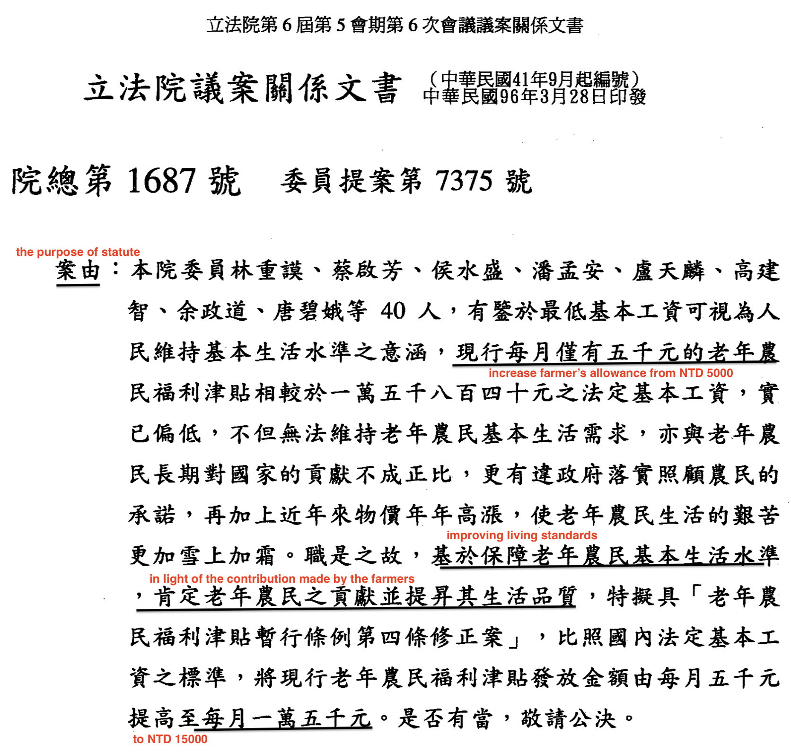

exclude: true


```{r include=FALSE}
if (!require("pacman")) install.packages("pacman")
library(pacman)
p_load(
  kableExtra, snakecase, janitor, huxtable, pagedown,                                                  # Formatting 
  ggplot2, ggthemes, ggeffects, ggridges, igraph, network, ggpubr, ggformula, gridExtra, RColorBrewer, # Visualization
  tidyverse, lubridate, stringr, dplyr, purrr, tibble, tidyr, lubridate, knitr,                        # General tidyverse toolkit 
  readxl,reshape2, 
  parallel, future, furrr, future.apply, doParallel,                                                   # Paralleling
  devtools, reticulate, usethis                                                                        # programming
)


# Define colors
red_pink   = "#e64173"
turquoise  = "#20B2AA"
orange     = "#FFA500"
red        = "#fb6107"
blue       = "#3b3b9a"
green      = "#8bb174"
grey_light = "grey70"
grey_mid   = "grey50"
grey_dark  = "grey20"
purple     = "#6A5ACD"
brown      = "#9b684d"
black      = "#000000"
magenta_red = "#9b4d80"
magenta_green = "#4d9b68"
red_green = "#9b4d59"
blue_green = "#4d599b"
magenta_yellow = "#9b8f4d"


# Knitr options
opts_chunk$set(
  comment = "#>",
  fig.align = "center",
  fig.height = 7,
  fig.width = 10.5,
  warning = F,
  message = F
)
opts_chunk$set(dev = "svg")
options(device = function(file, width, height) {
  svg(tempfile(), width = width, height = height)
})
options(knitr.table.format = "html")

```


```{python include=FALSE}
# Built-in Library
import math
import re
import collections
import zipfile
import random
from itertools import chain
import pandas as pd
import numpy as np

# ML & Deep Learning
from sklearn.model_selection import train_test_split
import tensorflow as tf
from tensorflow.keras import layers
import tensorflow_datasets as tfds
from tensorflow.keras.callbacks import EarlyStopping,TensorBoard
from transformers import BertTokenizer

# NLP toolkit
import spacy

# Visualization
import seaborn as sns
import matplotlib.pyplot as plt

# Dimensional Deduction
from sklearn.decomposition import PCA
```


---
layout: true
# Research Questions
---
name:questions

&nbsp;

- Measuring legislator behaviours and tendencies towards constituencies under different electoral systems is important.

- This paper quantitatively investigates this topic using the case of Taiwan Legislative Yuan and data on written parliamentary questions through an electoral reform from _multi-member districts (MMD)_ to _single-member districts (SMD)_. 

- Research Questions:

 1. Are the legislators in insingle non-transferable vote system (SNTV) more likely to ask more about .hi-grey[the provision of particularistic goods] in the parliamentary questions?

 2. Dose the reform change legislators' electoral strategies and behaviours?
 

---
layout: true
# Implication of PQs
---
name:questions

&nbsp;

- Legislaive activities such as .hi-grey[legislative votings],  .hi-grey[debates] (**e.g, Parspeech V2**) and .hi-grey[parliamentary questions] play a significant role in most democracies. 

- The advantages for focusing on parliamentary questions:


 1. The party leadership have less control over MP's motivation to employ parliamentary questions (Judge 1974, Shane 2011).


 2. Parliamentary questions may reveal MPs' interests in policy preference (Shane 2011).
 
 
---


&nbsp;
&nbsp;

- MPs ask questions for several reasons.

  1. Because of their .hi-grey[expertise] or domain responsibility of delegation for question topics.

  2. personal preference such as their nature of .hi-grey[substantive representation] (Russo 2021; Saalfeld 2011; Martin 2011)
  
  3. electoral motivation: .hi-grey[personal reputation] (Martin 2011)

  4. electoral rule and systems.
  
---

&nbsp;
&nbsp;

- In this paper, I introduce the case of .hi-grey[Taiwan Legislative Yuan], where the electoral system reformed through SNTV to SMD, to evaluate how electoral motives shape legislators' tendency to pork-barrel projects under different electoral systems. 


- In particular, parliamentary questions are the primary channel for legislators to .hi-grey[scrutinize the government] and .hi-grey[express political intentions]. 


- These parliamentary questions allow identification of different .hi-grey[question topics], .hi-grey[categories] and .hi-grey[further information] regarding .hi-grey[legislators' opinions of policy interests] and agenda at the individual level.

---
layout: true
# Background & Literature
---
name:questions

&nbsp;


- The SNTV-MMD was the major system to elect legislators before 2008 in Taiwan. 

- This was thought to intensify majority-seeking parties to run more than one candidate in a district, which increases incentives for candidates to run on personal votes against their party reputation (Cox 1990; Carey and Shugart 1995).

- The SNTV in Taiwan was criticized for creating .hi-grey[excessive intra-party chaos and competition] (Cox 1990; Hirano 2006; Ames 2001), as well as .hi-grey[encouraging factional and candidate-centered electoral politics] (e.g. Batto and Huang 2016; Wu 2003). 


---

&nbsp;

- Under SNTV, co-partisan candidates cannot rely exclusively on their party reputation and have to find an alternative means of attracting votes by .hi-grey[running on a personal reputation] via .hi-grey[providing paricularistic services] (Cain, Ferejohn, and Fiorina 1987; Reed 1994; Carey and Shugart 1995).

- Catalinac (2016) finds that LDP (Liberal Democratic Party) candidates under the SMDs in Japan adopted new electoral strategies by mentioning programmatic policies such as national security.

- Hypothesis:

  __1. Under SNTV-MMD, legislators are more likely to propose the questions regarding the provision of particularistic goods.__

  __1. Under SMD-MMM, legislators are more like to ask the questions related to programmatic and regulatory policies__

---
layout: true
# Parliarmentary Questions  
---
name:parliamentary-questions  

- In order to analyze parliamentary questions, I have webscraped the parliamentary questions from the official website of Taiwan Legislative Yuan from 1993 to 2020, including the relevant information about _the classified topics_, _selected keywords_ and the corresponding _question type_.
 
```{r echo = F, out.width = "55%"}
knitr::include_graphics("./images/image3.png")
```


---

&nbsp;

```{r echo = F, out.width = "80%"}

```

---
layout: true
# Research Design
---
name:research-design

### Training Deep Learning Model


- Existing labelled pork legislation


- Train a machine to identify pork-barrel features from parliamentary questions over time. 

```{r echo = F, out.width = "40%"}

```

### Regression


- Regression analyses are employed to answer the research questions.

---
layout: true
# Training Data
---


### Training Data: Pork-barrel Legislation


- The gold standard for identifying the pork-barrel legislation is based on the target beneficiaries of the policy (distributed vs concentrated)  and attributes of policy cost (distributed vs concentrated).

- Typical pork-barrel policies (or legislation) mainly incur distributed costs while generating parochial benefits for __specific regions__ or __designated population groups__.

```{r echo = F, out.width = "50%"}

```


---

### An Example of Pork Barrel Legislation

&nbsp;


```{r echo = F, out.width = "55%"}

```

---

### Number of Train/ Test Splits


- The collection of this data set consists of 7243 pieces of legislation which were annotated as Pork (with label 1) or Non-Pork (with label 0).

```{r echo = F, out.width = "55%"}

```

- This dataset was cross-coded by three researchers to perform its validity, which achieves 98% in terms of consistency and preciseness among coders.


---
layout: true
# Declaring DL Model
---

###  One-hot Encoding


```{r echo = F, out.width = "60%"}
knitr::include_graphics("./images/onehot.png")
```

---

###  Static Embedding Vectors 


```{r echo = F, out.width = "70%"}
knitr::include_graphics("./images/static.png")
```

---

###  Static Embedding Vectors 


```{python eval=FALSE}
nlp = spacy.load("en_core_web_sm")
vocab = nlp("R and Python are my favorite programming languages")
words = [word.text for word in vocab]
vecs = np.vstack([word.vector for word in vocab if word.has_vector])
pca = PCA(n_components=2)
vecs_transformed = pca.fit_transform(vecs)
```

```{python eval=FALSE}
plt.figure(figsize=(10, 7))
plt.scatter(vecs_transformed[:,0], vecs_transformed[:,1]) 
for word, coord in zip(words, vecs_transformed):
  x, y = coord
  plt.text(x, y, word, size=7)
plt.xlabel("Word Embedding via en_core_web_sm model from SpaCy")  
plt.show()
```

---

###  Contexted-based BERT Embedding


```{r echo = F, out.width = "80%"}
knitr::include_graphics("./images/vis1.png")
```

---

###  Contexted-based BERT Embedding

```{python eval=FALSE}
from transformers import AutoTokenizer
from bertviz.transformers_neuron_view import BertModel 
from bertviz.neuron_view import show
tokenizer = AutoTokenizer.from_pretrained("bert-base-uncased")
model = BertModel.from_pretrained("bert-base-uncased")
text = "R and Python are my favorite programming languages [SEP] Python is a snake"
show(model, "bert", tokenizer, text, display_mode="light", layer=0, head=8)
```

---

### BERT Layers + Convolutional Neural Nets 


```{r echo = F, out.width = "80%"}

```


---
layout: true
# Performances
---
name:parliarmentary-questions  

&nbsp;

```{r echo = F, out.width = "80%"}

```


---
layout: true
# Pork Featured 
---
name:sampled-pork
 
&nbsp;
&nbsp;
&nbsp;
&nbsp;

| Legislator |       Questions         |                  Topics                      |                        Keywords                      |
|:----------:|:------------------------|----------------------------------------------|------------------------------------------------------|
| 陳啟昱	   |鑑於現行《所得稅法》第十.| Income tax; education expenses; deductions   | Special Deductions; Educational Expenditure          |
| 彭添富	   |針對「辦理九十四年原住民 | Aboriginal life                              |	housing subsidies                                    |
| 李復興	   |發現自九十三年一月間起   | Old-age benefits; labor retirement           |	Retired employees allowance for the elderly          |
| 盧秀燕	   |針對早期退除役軍官給與補 | Veterans welfare                             |	Grants for early retired officers                    |
| 丁守中	   |針就民眾陳情指出，目前政 | Welfare for the handicapped                  |	Living allowance                                     |
| 馮定國	   |鑒於國內經濟結構的快速   | Elderly Welfare                              |	Aging; middle and old age unemployment               |
| 彭添富	   |針對「豪雨成災，         | Agricultural Subsidies                       |	Heavy rain; crops                                    |
| 曾華德	   |為民國38年至43年間戌     | Military Pay                                 |	Anti-Communist Salvation Army Reimbursement of Salary|


---
layout: true
# Less-pork Featured 
---
name:sampled-non-pork

&nbsp;
&nbsp;
&nbsp;
&nbsp;

| Legislator |       Questions         |                  Topics                      |                        Keywords                      |
|:----------:|:------------------------|----------------------------------------------|------------------------------------------------------|
| 李復甸	   |鑑於刑事偵察實務上緩起   |Investigation; litigation procedure           |	Criminal investigation; secret witness               |
| 林建榮	   |為立法院朝野協商修改銀   |Financial management; bank management         |	Banking Law; Cash Card; Revolving Interest Rate      |
| 林正峰	   |針對行政院長張俊雄日前   |Energy policy                                 |	Energy saving                                        |
| 林正峰	   |鑑於近年來臺灣地區毒品   |Tobacco Restriction; Hospital                 |	Drug Abuse; Departmental Hospital                    |
| 王幸男	   |針對道路人孔蓋或管線挖   |Public Safety                                 |	Manhole cover; public safety; road quality           |
| 管碧玲	   |針對近日台灣鐵路管理局	 |Railway management; ticket	                  | Online booking; monopoly; Taiwan Railway             |
| 黃敏惠	   |就近日來爆發知名提神飲   |Drinks; Poisoning                             |	Drinks; Poisoning                                    |
| 陳朝龍	   |針對英國政府宣稱台灣出   |Infectious disease prevention and control     |	British Government; Taiwanese birds; Avian Influenza |


---
layout: true
# Tentative Findings
---
name:parliarmentary-questions  


&nbsp;


```{r echo = F, out.width = "80%"}
knitr::include_graphics("./images/num.png")
```

---

&nbsp;


```{r echo = F, out.width = "80%"}
knitr::include_graphics("./images/mean.png")
```


---

&nbsp;


```{r echo = F, out.width = "80%"}

```


---
layout: true
# Takeaway
---

&nbsp;


- Evidence exists to show that legislators under SNTV are more likely to ask pork-barrel projects in the questions. 


- The reform  demonstrates heterogeneous effects on major parties vis-à-vis the minority parties  


- The Limitation:

  1. the pork barrel legislation from training data used in this paper has been nearly ten years. The deep learning classifier might fail to capture unknown concepts developed in the post-reform period. 

  2. a steady decrease in the total number of questions since 2003

  3. Explainable Machine Learning: in Chinese or other Non-English languages might be somewhat challenging for social science students.


---
layout: false
class: inverse, center, middle

# Thank You

---
layout: true
# Appendix
---
name:appendix


### Miscellaneous

- .smaller[PorkCNN: A Small Project for Pork Barrel Legislation Classification Using Convolutional Neural Networks (https://github.com/davidycliao/PorkCNN)]

- .smaller[Tensorboard of PorkCNN (https://tensorboard.dev/experiment/2Jm6GKexQiKaLyUz5uKSzg/#scalars)]

- .smaller[legisCrawler: An Automation Webcrawling Toolkit for Retrieving Taiwan Parliamentary Questions (https://github.com/davidycliao/legisCrawler)]


```{r eval=FALSE, include=FALSE}
pagedown::chrome_print("file:///Users/yenchiehliao/Dropbox/erpb/slides/slides.html#1", verbose = FALSE)
```

