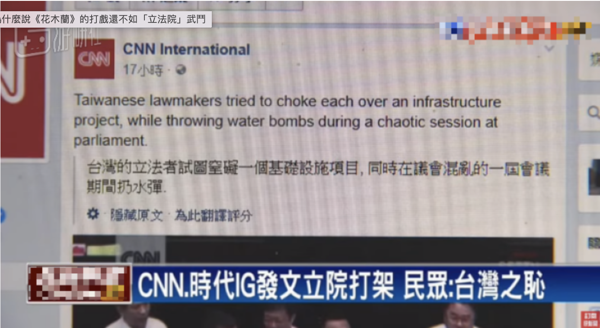

exclude: true


```{r include=FALSE}
if (!require("pacman")) install.packages("pacman")
library(pacman)
p_load(
  kableExtra, snakecase, janitor, huxtable, pagedown,                                                  # Formatting 
  ggplot2, ggthemes, ggeffects, ggridges, igraph, network, ggpubr, ggformula, gridExtra, RColorBrewer, # Visualization
  tidyverse, lubridate, stringr, dplyr, purrr, tibble, tidyr, lubridate, knitr,                        # General tidyverse toolkit 
  readxl,reshape2, 
  parallel, future, furrr, future.apply, doParallel,                                                   # Paralleling
  devtools, reticulate, usethis                                                                        # programming
)


# Define colors
red_pink   = "#e64173"
turquoise  = "#20B2AA"
orange     = "#FFA500"
red        = "#fb6107"
blue       = "#3b3b9a"
green      = "#8bb174"
grey_light = "grey70"
grey_mid   = "grey50"
grey_dark  = "grey20"
purple     = "#6A5ACD"
brown      = "#9b684d"
black      = "#000000"
magenta_red = "#9b4d80"
magenta_green = "#4d9b68"
red_green = "#9b4d59"
blue_green = "#4d599b"
magenta_yellow = "#9b8f4d"


# Knitr options
opts_chunk$set(
  comment = "#>",
  fig.align = "center",
  fig.height = 7,
  fig.width = 10.5,
  warning = F,
  message = F
)
opts_chunk$set(dev = "svg")
options(device = function(file, width, height) {
  svg(tempfile(), width = width, height = height)
})
options(knitr.table.format = "html")

```


```{python include=FALSE}
# Built-in Library
import math
import re
import collections
import zipfile
import random
from itertools import chain
import pandas as pd
import numpy as np

# ML & Deep Learning
from sklearn.model_selection import train_test_split
import tensorflow as tf
from tensorflow.keras import layers
import tensorflow_datasets as tfds
from tensorflow.keras.callbacks import EarlyStopping,TensorBoard
from transformers import BertTokenizer

# NLP toolkit
import spacy

# Visualization
import seaborn as sns
import matplotlib.pyplot as plt

# Dimensional Deduction
from sklearn.decomposition import PCA
```


---
layout: true
# Research Questions
---
name:questions

&nbsp;

- Measuring legislator behaviours and tendencies towards constituencies under different electoral systems is important.

--

- In this paper, I quantitatively investigate legislators’ pork-barrel behavior on .hi-grey[parliamentary questions] using the case of Taiwan Legislative Yuan. 

--

- Research Questions:

--

 1. Are the legislators in insingle non-transferable vote system (SNTV) more likely to ask more about .hi-grey[the provision of particularistic goods] in the parliamentary questions?
 
--

 2. Dose the reform change legislators' electoral strategies and behaviours?
 

---
layout: true
# Implication of PQs
---
name:questions

&nbsp;

- Parliamentary activities such as .hi-grey[debates] (**Parspeech V2**) and .hi-grey[parliamentary questions] play a significant role in most parliamentary democracies. 

--

- The advantages for focusing on parliamentary questions:

--

 1. The party leadership have less control over MP's motivation to employ parliamentary questions (Judge 1974, Shane 2011).
 
--

 2. Parliamentary questions may reveal MPs' interests in policy preference (Shane 2011).
 
 
---


&nbsp;
&nbsp;

- MPs ask questions for several reasons.

--

  1. Because of their .hi-grey[expertise] or domain responsibility of delegation for question topics.
  
--

  2. personal preference such as their nature of .hi-grey[substantive representation] (Russo 2021; Saalfeld 2011; Martin 2011)
  
--

  3. electoral motivation: .hi-grey[personal reputation] (Martin 2011)

--

  4. electoral rule and systems.
  
---

&nbsp;
&nbsp;

- In this paper, I introduce the case of .hi-grey[Taiwan Legislative Yuan], where the electoral system reformed through SNTV to SMD, to evaluate how electoral motives shape legislators' tendency to pork-barrel projects under different electoral systems. 

--

- In particular, parliamentary questions are the primary channel for legislators to .hi-grey[scrutinize the government] and .hi-grey[express political intentions]. 

--


- These parliamentary questions allow identification of different .hi-grey[question topics], .hi-grey[categories] and .hi-grey[further information] regarding .hi-grey[legislators' opinions of policy interests] and agenda at the individual level.

---
layout: true
# Background
---
name:questions


- The SNTV-MMD was the major system to elect legislators before 2008 in Taiwan. 

--

- This was thought to intensify majority-seeking parties to run more than one candidate in a district, which increases incentives for candidates to run on personal votes against their party reputation. 

--

```{r echo = F, out.width = "40%", fig.cap="Source : https://www.xoer.cc/3461616"}

```

--

- The SNTV in Taiwan was criticized for creating .hi-grey[excessive intra-party chaos and competition] (Cox 1990; Hirano 2006; Ames 2001), as well as .hi-grey[encouraging factional and candidate-centered electoral politics] (e.g. Batto and Huang 2016; Wu 2003). 


---
layout: true
# The Literature: Personal Votes
---
name:literature

&nbsp;

- The electoral system such as SNTV-MMD, which combines plurality rule with a single vote per voter and a district magnitude larger than one, was believed to .hi-grey[increase intra-party (centrifugal) competition] (Cox 1990; Carey and Shugart 1995).

--

- Under the SNTV-MMD, parties or party leaders have incentive to nominate more than one candidate to run in each district, which required their .hi-grey[candidates to compete against each other]. 

--

- Therefore, co-partisan candidates cannot rely exclusively on their party reputation and have to find an alternative means of attracting votes by .hi-grey[running on a personal reputation] via providing paricularistic services as called “personal vote” (Cain, Ferejohn, and Fiorina 1987; Reed 1994; Carey and Shugart 1995).

---
layout: true
# The Literature: Pork Barrel Politics
---
name:literature

- An examination of the relationship between electoral systems and the “pork-barrel” phenomenon is being investigated in light of the explosion of interest in the past decade in .hi-grey[the effects of different electoral systems] on policy outputs (e.g., Hirano 2005; Samuels 2002; Stratmann and Baur 2002; Lancaster and Patterson 1990; Lancaster 1986). 

--

- The literature focusing on Taiwan distributive politics has investigated the effects of the electoral reform that .hi-grey[decreases legislators' incentive to bring home the bacon].

--

- For example, Sheng (2014a) and Sheng (2014b) investigate the impacts of electoral reform on changes of bill sponsorship with regards to particularistic goods among legislators. Luor and Hsieh (2008) and Luor and Liao (2009) focus on the impact of district magnitude on legislators’ incentive to propose pork barrel-related bills. 

--

- In similar, Catalinac (2016) finds that LDP (Liberal Democratic Party) candidates under the SMDs in Japan adopted new electoral strategies by mentioning programmatic policies such as national security.


---
layout: true
# Parliarmentary Questions  
---
name:parliamentary-questions  

- In order to analyze parliamentary questions, I have webscraped the parliamentary questions from the official website of Taiwan Legislative Yuan from 1993 to 2020, including the relevant information about the classified topics, selected keywords and the corresponding question type.
 
```{r echo = F, out.width = "55%"}

```


---

&nbsp;

```{r echo = F, out.width = "80%"}
knitr::include_graphics("./images/top30.png")
```

---
layout: true
# Research Design
---
name:research-design

### Training Deep Learning Model

--

- Existing labelled pork legislation

--

- Train a deep learning model to measure pork-barrel features on parliamentary questions over time. 

```{r echo = F, out.width = "35%"}
knitr::include_graphics("./images/diagram.png")
```
--

### Regression

--

- DiD Desgin ❌

--

- Regression analyses are employed to answer the research questions.


---
layout: true
# Training Data
---


### Training Data: Pork-barrel Legislation

--

- The classification of these bills is typically based on the nature of the associated costs (distributed vs concentrated) and associated benefits (distributed vs concentrated).

--

```{r echo = F, out.width = "65%"}
knitr::include_graphics("./images/porktype.png")
```

###### Source: Wilson and DiIulio (2001)

---

### An Example of Pork Barrel Legislation

&nbsp;

--

```{r echo = F, out.width = "55%"}
knitr::include_graphics("./images/billeg.png")
```

---

### Number of Train/ Test Splits

--

- The collection of this data set consists of 7243 pieces of legislation which were annotated as Pork (with label 1) or Non-Pork (with label 0).

```{r echo = F, out.width = "55%"}
knitr::include_graphics("./images/full_plot.png")
```

--

- This dataset was cross-coded by three researchers to perform its validity, which achieves 98% in terms of consistency and preciseness among coders.


---
layout: true
# Declaring DL Model
---

### BERT Layers + Convolutional Neural Nets 

--

```{r echo = F, out.width = "80%"}
knitr::include_graphics("./images/framework.png")
```


---

###  One-hot Encoding

--


```{r echo = F, out.width = "60%"}
knitr::include_graphics("./images/onehot.png")
```

---

###  Static Embedding Vectors 

--

```{python eval=FALSE}
nlp = spacy.load("en_core_web_sm")
vocab = nlp("R and Python are my favorite programming languages")
words = [word.text for word in vocab]
vecs = np.vstack([word.vector for word in vocab if word.has_vector])
pca = PCA(n_components=2)
vecs_transformed = pca.fit_transform(vecs)
```

```{python eval=FALSE}
plt.figure(figsize=(10, 7))
plt.scatter(vecs_transformed[:,0], vecs_transformed[:,1]) 
for word, coord in zip(words, vecs_transformed):
  x, y = coord
  plt.text(x, y, word, size=7)
plt.xlabel("Word Embedding via en_core_web_sm model from SpaCy")  
plt.show()
```

---

###  Static Embedding Vectors 

--

```{r echo = F, out.width = "70%"}
knitr::include_graphics("./images/static.png")
```


---

###  Contexted-based BERT Embedding

```{python eval=FALSE}
from transformers import AutoTokenizer
from bertviz.transformers_neuron_view import BertModel 
from bertviz.neuron_view import show
tokenizer = AutoTokenizer.from_pretrained("bert-base-uncased")
model = BertModel.from_pretrained("bert-base-uncased")
text = "R and Python are my favorite programming languages [SEP] Python is a snake"
show(model, "bert", tokenizer, text, display_mode="light", layer=0, head=8)
```

---

###  Contexted-based BERT Embedding


```{r echo = F, out.width = "80%"}
knitr::include_graphics("./images/vis1.png")
```


---
layout: true
# Performances
---
name:parliarmentary-questions  

&nbsp;

```{r echo = F, out.width = "80%"}
knitr::include_graphics("./images/performance.png")
```


---
layout: true
# Pork Featured 
---
name:sampled-pork
 
&nbsp;
&nbsp;
&nbsp;
&nbsp;

| Legislator |       Questions         |                  Topics                      |                        Keywords                      |
|:----------:|:------------------------|----------------------------------------------|------------------------------------------------------|
| 陳啟昱	   |鑑於現行《所得稅法》第十.| Income tax; education expenses; deductions   | Special Deductions; Educational Expenditure          |
| 彭添富	   |針對「辦理九十四年原住民 | Aboriginal life                              |	housing subsidies                                    |
| 李復興	   |發現自九十三年一月間起   | Old-age benefits; labor retirement           |	Retired employees allowance for the elderly          |
| 盧秀燕	   |針對早期退除役軍官給與補 | Veterans welfare                             |	Grants for early retired officers                    |
| 丁守中	   |針就民眾陳情指出，目前政 | Welfare for the handicapped                  |	Living allowance                                     |
| 馮定國	   |鑒於國內經濟結構的快速   | Elderly Welfare                              |	Aging; middle and old age unemployment               |
| 彭添富	   |針對「豪雨成災，         | Agricultural Subsidies                       |	Heavy rain; crops                                    |
| 曾華德	   |為民國38年至43年間戌     | Military Pay                                 |	Anti-Communist Salvation Army Reimbursement of Salary|


---
layout: true
# Less-pork Featured 
---
name:sampled-non-pork

&nbsp;
&nbsp;
&nbsp;
&nbsp;

| Legislator |       Questions         |                  Topics                      |                        Keywords                      |
|:----------:|:------------------------|----------------------------------------------|------------------------------------------------------|
| 李復甸	   |鑑於刑事偵察實務上緩起   |Investigation; litigation procedure           |	Criminal investigation; secret witness               |
| 林建榮	   |為立法院朝野協商修改銀   |Financial management; bank management         |	Banking Law; Cash Card; Revolving Interest Rate      |
| 林正峰	   |針對行政院長張俊雄日前   |Energy policy                                 |	Energy saving                                        |
| 林正峰	   |鑑於近年來臺灣地區毒品   |Tobacco Restriction; Hospital                 |	Drug Abuse; Departmental Hospital                    |
| 王幸男	   |針對道路人孔蓋或管線挖   |Public Safety                                 |	Manhole cover; public safety; road quality           |
| 管碧玲	   |針對近日台灣鐵路管理局	 |Railway management; ticket	                  | Online booking; monopoly; Taiwan Railway             |
| 黃敏惠	   |就近日來爆發知名提神飲   |Drinks; Poisoning                             |	Drinks; Poisoning                                    |
| 陳朝龍	   |針對英國政府宣稱台灣出   |Infectious disease prevention and control     |	British Government; Taiwanese birds; Avian Influenza |


---
layout: true
# Tentative Findings
---
name:parliarmentary-questions  


&nbsp;


```{r echo = F, out.width = "80%"}
knitr::include_graphics("./images/reg.png")
```

---

&nbsp;


```{r echo = F, out.width = "80%"}
knitr::include_graphics("./images/num.png")
```

---

&nbsp;


```{r echo = F, out.width = "80%"}
knitr::include_graphics("./images/mean.png")
```


---
layout: true
# Takeaway
---

&nbsp;


- Evidence exists to show that legislators under MMD are more likely to express political intention about pork-barrel projects in written parliamentary questions. 

--

- The reform subsequently demonstrates heterogeneous effects on major parties vis-à-vis the minority parties, respectively.  

--

- Similar approach can be applied in European democracies.

--

- The Limitation:

--

  1. Training data originates from 2004-to 2007. 

--

  2. Can the model be applied to earlier or later periods?

--

  3. Conducting explainable machine learning in Chinese or other Non-English languages may be somewhat challenging for social science students.


---
layout: false
class: inverse, center, middle

# Thank You

---
layout: true
# Appendix
---
name:appendix


### Miscellaneous

- .smaller[PorkCNN: A Small Project for Pork Barrel Legislation Classification Using Convolutional Neural Networks (https://github.com/davidycliao/PorkCNN)]

- .smaller[Tensorboard of PorkCNN (https://tensorboard.dev/experiment/2Jm6GKexQiKaLyUz5uKSzg/#scalars)]

- .smaller[legisCrawler: An Automation Webcrawling Toolkit for Retrieving Taiwan Parliamentary Questions (https://github.com/davidycliao/legisCrawler)]


```{r eval=FALSE, include=FALSE}
pagedown::chrome_print("file:///Users/yenchiehliao/Dropbox/elp/slides/slides.html#1", verbose = FALSE)
```

